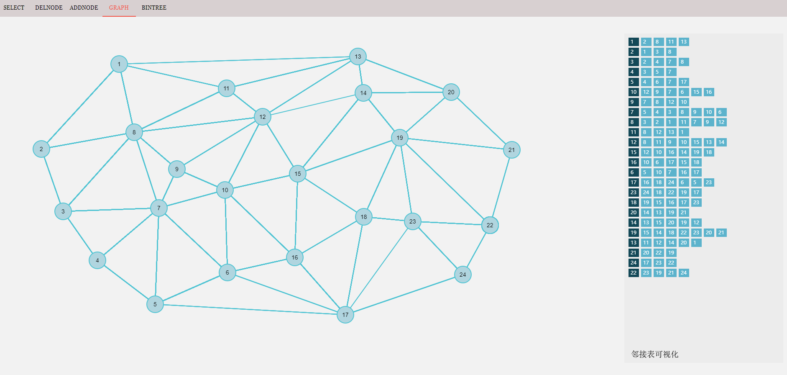

# Topo-visualization

*current version 0.0.2*

> The `BinTree` mode is not available now : )

## Introduction

This is a beta version of `Graph` or `Topology` visualization tools which can help you draw networks quickly. Here is a shortcut of the framework:

## Handbook
### Toolbar
The toolbar is located on the top of the screen. So far there has **5** buttons.

- `SELECT`: the default mode, in which you can drag the node on the canvas to update their positions.
- `DELNODE`: in this mode you can click on the node on the canvas to delete a node. Note that all the line linked to the node will be deleted automtically.
- `ADDNODE`: in this mode you can add a node on the canvas by click on a flat region.
- `GRAPH`: in this mode you can click on a node and then click on the other node to make a connection between the two nodes.
- `BINTREE`: not available so far.

### Setting values / weights
Right click on the node or edge to set the value / weight.

## Functions

The current version is just the simplest tools with which you can add/delete nodes and add edges. What's more, the adjacency list will generate automatically.

In the future, some of the functions will be developed:

- Better user interface
- More basic settings
- **Basic graph algorithms visualization**
  - Shortest path: Dijkstra, Floyd
  - Minimum spanning tree: Prim, Kruskal
- Binary tree visualization

## Development Logs

- #### version 0.0.1

  2018-08: Basic drawing functions

- #### version 0.0.2 (the current version)

  2020-01: Provide more function for drawing graph:

  - Edges in the graph can be weighted.
  - Add the adjacency list modules. **(TO BE OPTIMIZATION)**
  - Make the interface more user-friendly.

## Author Information

Howard Wonanut, a graduate student in Xi'an Jiaotong University, Shaanxi, China.
